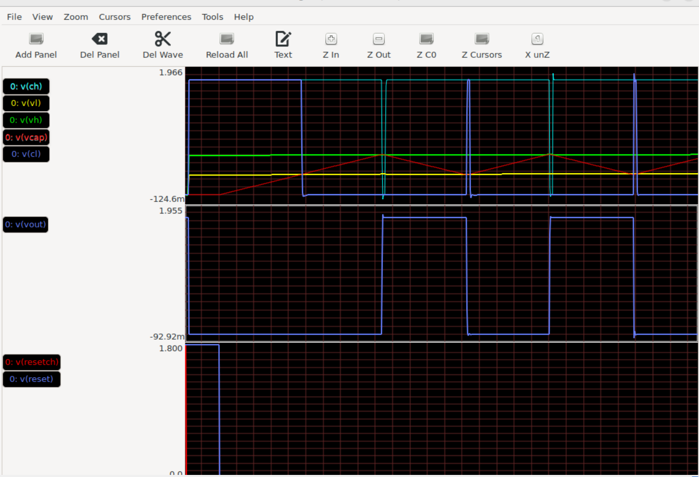

<!---

This file is used to generate your project datasheet. Please fill in the information below and delete any unused
sections.

You can also include images in this folder and reference them in the markdown. Each image must be less than
512 kb in size, and the combined size of all images must be less than 1 MB.
-->

## How it works

A Time to Digital Converter (TDC) is a circuit that measures the time interval between two events with high precision and converts this into a digital value. TDCs are fundamental components in various applications, including digital communications, radar systems, particle physics experiments, etc.
The operation of a TDC can be classified into two types: direct and indirect measurement methods. Direct measurement capture time interval using a high-speed clock signal and a counter, while indirect methods employ in the first stage a Time-to-Voltage conversion followed by an analog-to-digital conversion or other similar blocks. 
The resolution of a TDC is determined by the frequency of the clock that drives the counter (Resolution=1/clock_frequency). Resolution in a TDC is defined as the smallest time difference that can be measured and distinguished by the converter. To achieve a balance between high resolution and wide dynamic range, it involves the use of coarse and fine resolution measurements within a single TDC architecture. Coarse resolution typically achieved using a counter that increments in every cycle of a clock. Fine resolution is employed to measure smaller segments of time within the coarse intervals, significantly improving the overall precision of the TDC often realized through techniques like time interpolation, delay line encoding, or the use of high-frequency clocks for a short duration. 
In a TDC using coarse and fine resolutions, the time interval between two events is first quantified in coarse units. Then, the fine resolution measures the fraction of the coarse unit that remains unaccounted for at the end of the interval. The total resolution is a combination of both resolutions, where the fine resolution refines the measurement within one coarse clock cycle. This combination offers a detailed time measurement while maintaining the capability to measure long intervals.
The circuit present here comprises the analog part for the fine resolution of a Time to Digital Converter based on time interpolation. A width input pulse in the interval of 20 to 60 nanoseconds is converted to a periodic square signal with a period that is 90 times wider than the input pulse. So, we can use a counter with a low frequency clock to convert the time input pulse to digital format. For example, if we use a 25MHz clock frequency, we can measure the time of the input pulse with a resolution of 444ps.    
In the Fig. 1 we can see the block diagram of the System. We introduce an input pulse on the input "Time" (after applying a reset on the capacitors) and charge the two capacitors in the first block with a constant current. They stop charging when the pulse finishes. The second block uses the voltages generated in the first block as references to charge and discharge a capacitor, generating a square signal at the output. The period of the output signal is equal to: T=90*Delta_Time.

**Figure 1.** Block diagram of the System.

## How to test
Figure 2 shows the block of the System with all the inputs and outputs that we can access in the circuit. The diagram shows the signal that we need to apply for to get the desired output signal. We can apply a width pulse between 20 to 60ns, besides the reset signal, one before the pulse and one after the pulse, like are shown in the Figure.

**Figure 2.** Inputs and Outputs of the System and test signals.

The Figure 3 shows the simulation results for reference.

**Figure 3.** Simulation results.

## External hardware
You need only a digital signal generator and an oscilloscope.
